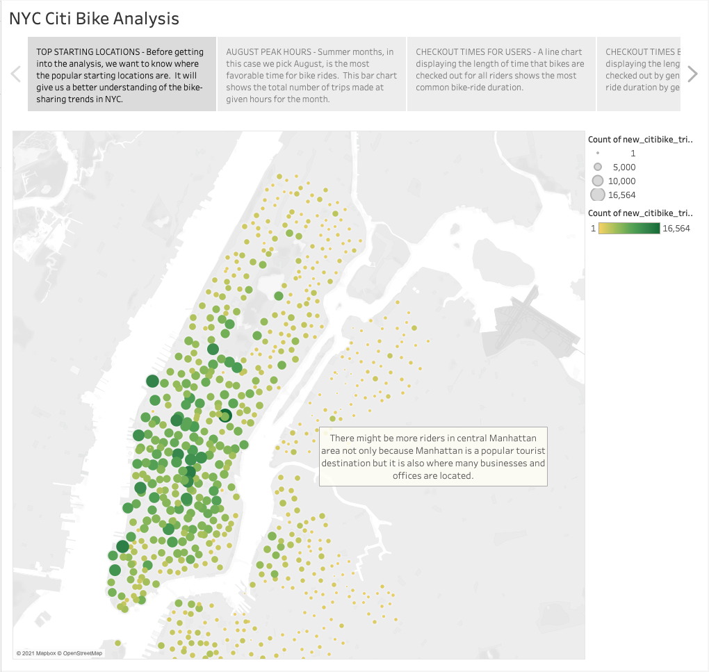
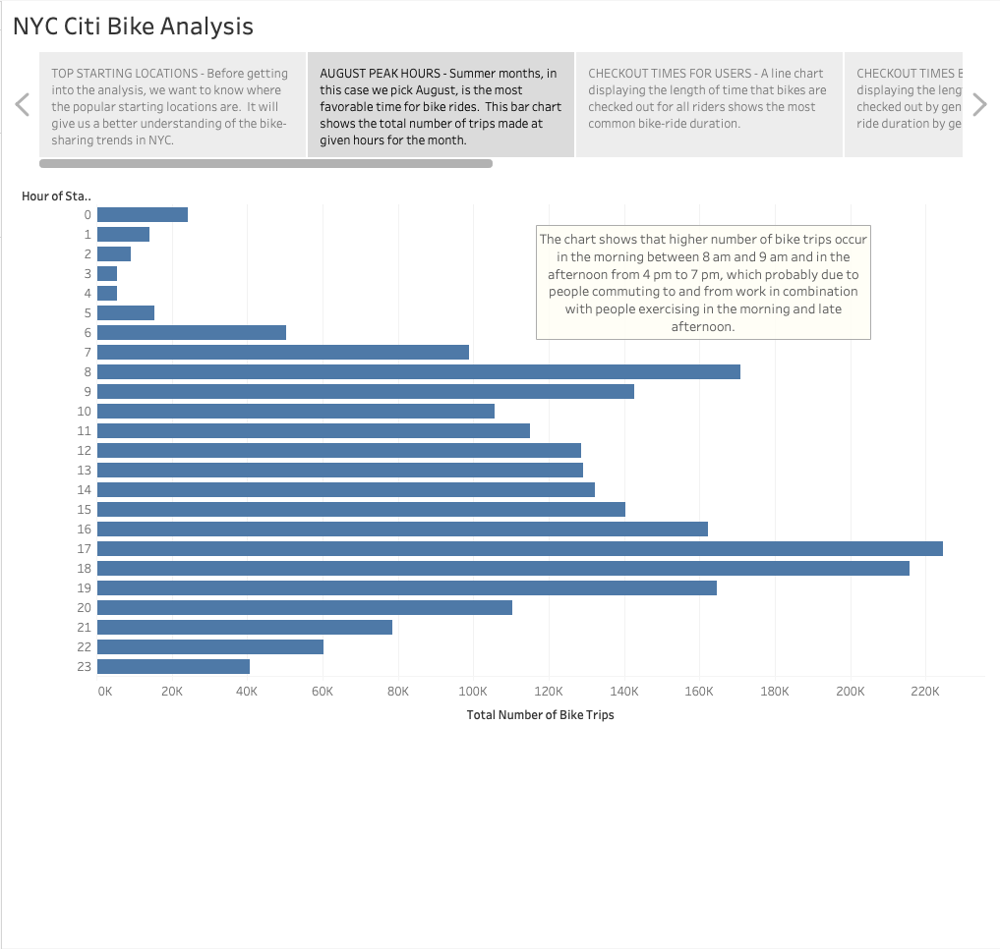
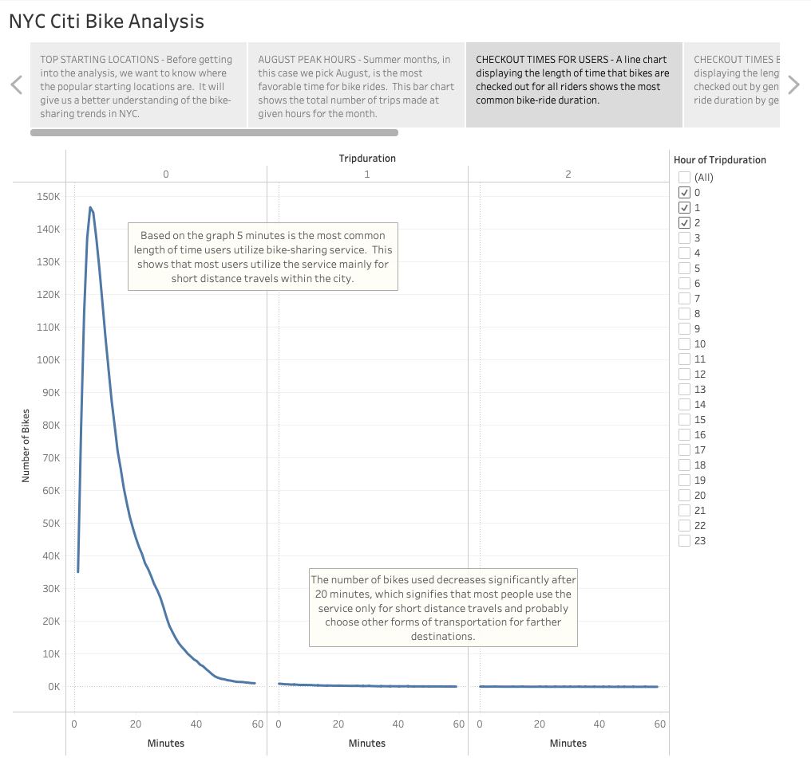
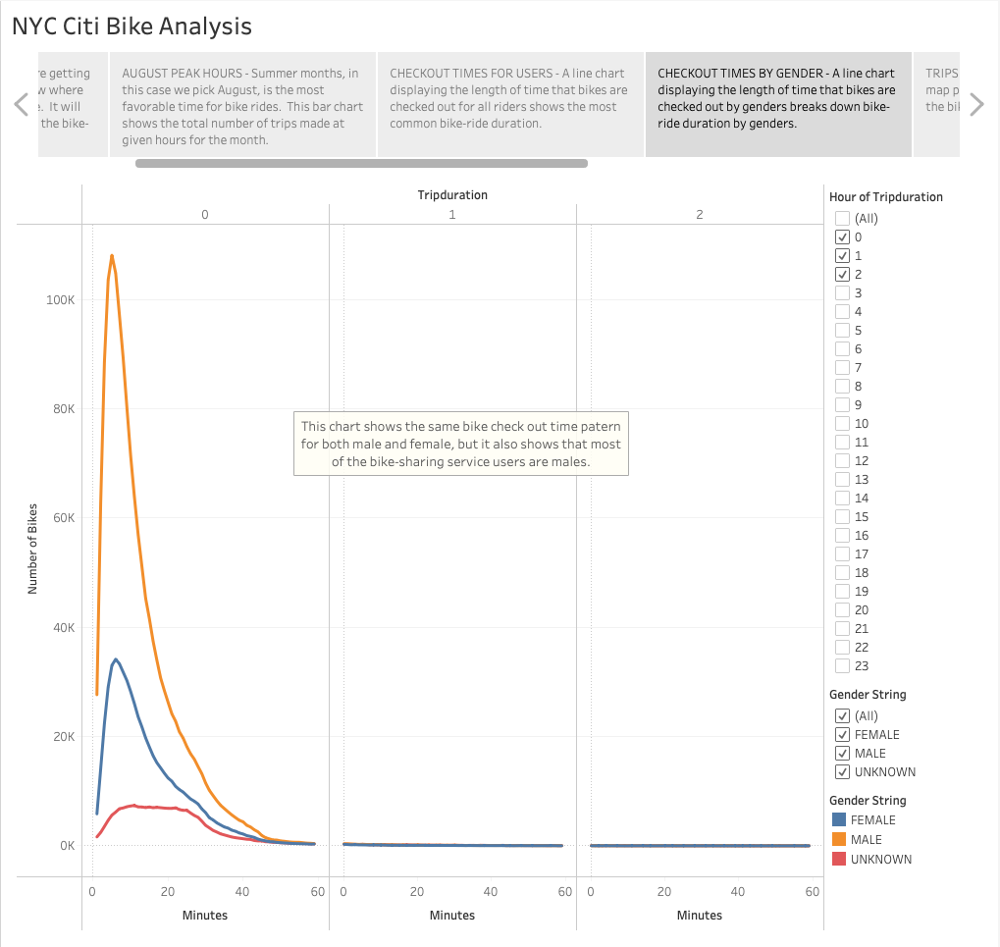
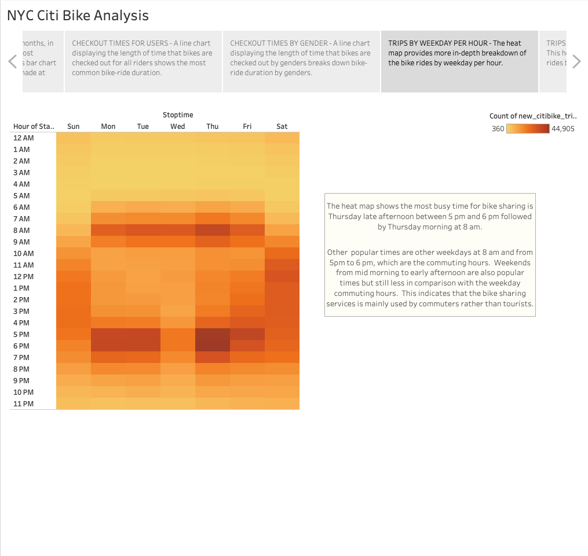
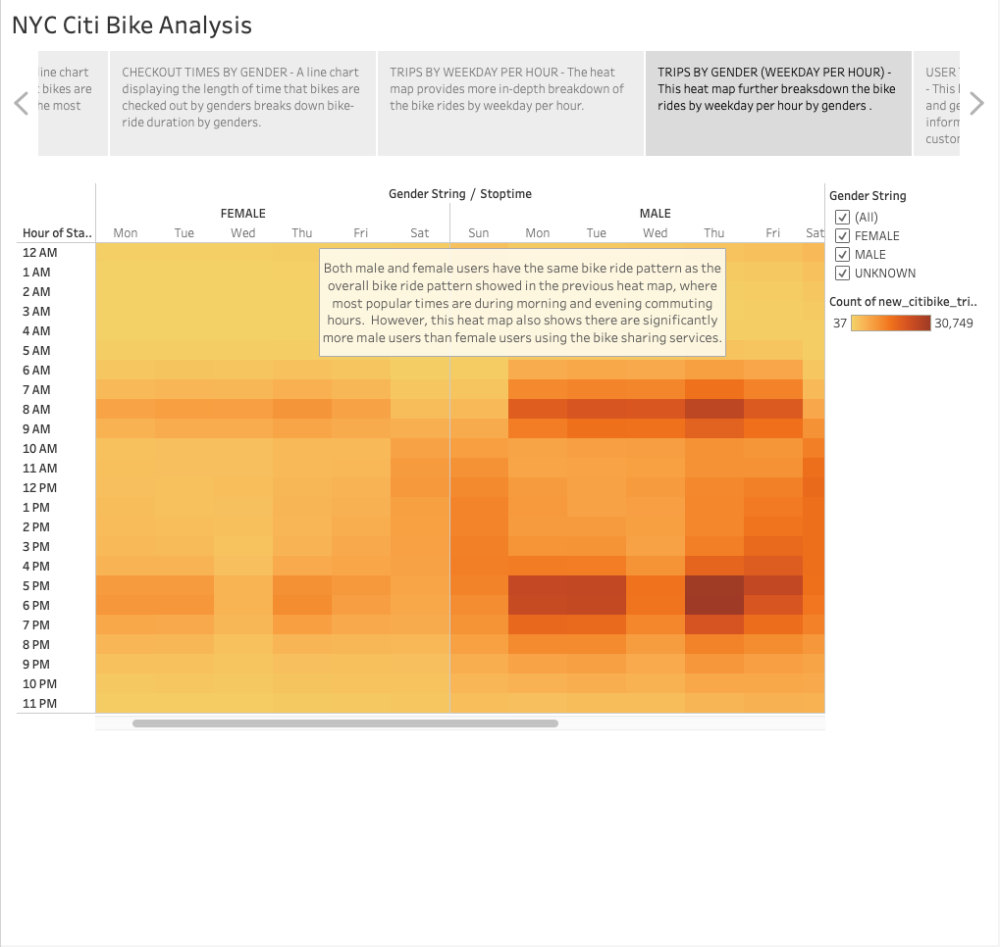
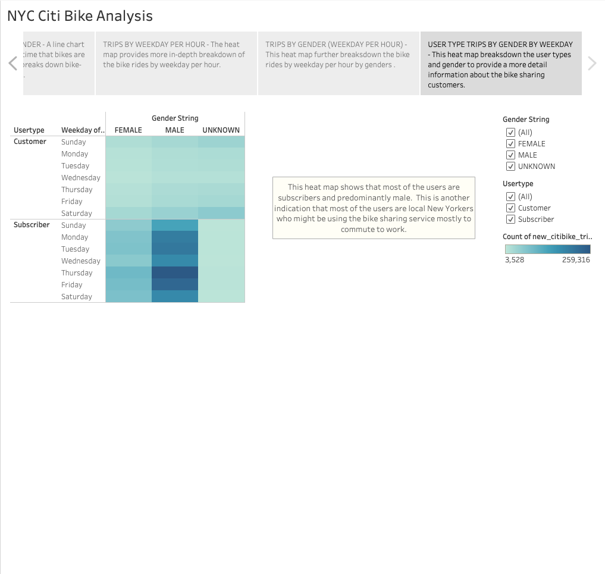

# **Module14-Bikesharing-Tableau**

## **Overview of the analysis**

#### The purpose of this project is to create an insightful analysis for a proposal that will be presented to potential investors who might be interested to invest in the bike-sharing business in Des Moines, Iowa. From the given dataset, we created data visualizations that show popular bike riding locations, days, times, and durations for all users as well as broken down by gender and user types.

## **Results**

### Results for each visualization can be read in the text box next to each graph/map.

### **Click the link below to view the story on Tableau:**
[NYC Citi Bike-Sharing Analysis](https://public.tableau.com/app/profile/david.zachie/viz/Module14_NYC_Citibike_Challenge/NYCCitiBikeAnalysis?publish=yes)

### **Top Starting Locations**

### **August Peak Hours**

### **Checkout Times for Users**

### **Checkout Times by Gender**

### **Trips by Weekday per Hour**

### **Trips by Gender (Weekday per Hour)**

### **User Type Trips by Gender by Weekday**

## **Summary**

### From this analysis we can summarize our finding as follows:
###     * Most users are using the bike-ride service for short period of time and distances and mainly in the busy business districts.  
###     * In addition, most of the trips occur during weekdays and around the work commuting hours, in the morning and early evening.
###     * Finally, majority of the user type is subscriber, which means they are local New Yorkers who use the service on regular basis and most of them are males.

### Based on the findings we can conclude that the bike-ride service in NYC is mainly used by work commuters and predominantly males.  These informations can be usefull in creating various marketing campaigns such as retention campaign targeting male users to retain current customers and increase loyalty or customer acquisition campaign targeting female users and visitors to expand citi-bike customer base.  This data can also be used to determine bike-service rate (for instance, we could charge higher rate during peak hours), strategic bike station locations, and number of available bikes to meet market demand.  This analysis, can be modified and adapted to Des Moines market by looking at local demographic, geographic, and economical factors that would impact the business.
